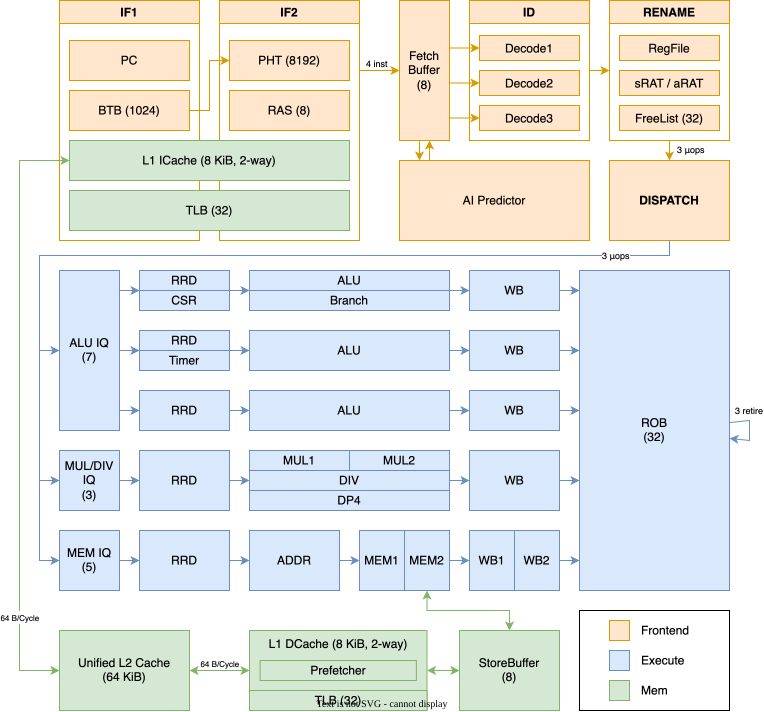

# Gemmont: A High-Performance Out-of-Order Superscalar LA32R Processor for AI Agents

[ [Report](https://github.com/SuperscalarCrash/report/tree/main/build/report.pdf) ] [ [Slides](https://github.com/SuperscalarCrash/report/tree/main/build/slides.pdf) ]

Authors: [Keyu Zhu](https://github.com/inuEbisu), [Hao Yi](https://github.com/eWloYW8), [Ye Liu](https://github.com/yegroup001), [Yu Huang](https://github.com/514InParadox)

> Gemmont 是第十届「龙芯杯」全国大学生计算机系统能力大赛 CPU 设计赛 (NSCSCC 2026) 的参赛作品。
>
> Gemmont 是一款 32 位龙架构精简版（LoongArch32 Reduced / LA32R）**乱序超标量**处理器核心，采用基于 Tomasulo 算法与重排序缓存（ROB）的乱序多发射微架构，包括 5 条执行流水线，4 取指、3 译码、3 提交，最长 13 级流水线。相较往届作品，我们在微架构上的主要创新为引入了 **AI 分支预测器**、64 KiB 统一 **L2 缓存**、**L1 预取器**等。
>
> 性能方面，我们最终主频达到 **109.09 MHz**，在所有乱序核中排名**第一**；周期数相对 openLA500 基线几何平均加速 **1.975x**，总加速 **6.583x**；最终成绩在所有参赛队伍中排名 **4/549**。
>
> 系统展示方面，为替换大赛提供的 Linux 5.14.0-rc2 陈旧内核与 GCC 8 等工具链，我们**将最新 Linux 7.1.4 主线内核、最新 GCC 16、glibc 2.44 与 Go 语言移植至 LA32R 指令集**。我们使用 Buildroot 构建包含 SSH、X 桌面、PicoClaw 等应用软件的**嵌入式 Linux 发行版**，并通过 NFS root 启动。另外，我们在微架构上设置 **DP4 点积**扩展指令，在端侧实现了 **10 s/token 的大模型推理**。Gemmont 可以**稳定启动 Linux** 并运行发行版中所有软件，同时驱动板上包括全速 USB 在内的**全部外设**。

<!-- split -->

## Navigation

The complete hardware and software stack is hosted under the [SuperscalarCrash](https://github.com/SuperscalarCrash) organization:

| Repository                                                   | Description                                                                     |
| :----------------------------------------------------------- | :------------------------------------------------------------------------------ |
| **[Gemmont](https://github.com/SuperscalarCrash/Gemmont)**   | Out-of-order superscalar LA32R processor core (Chisel 3.6). *(This repository)* |
| **[chiplab](https://github.com/SuperscalarCrash/chiplab)**   | Simulation platform, Difftest co-verification framework, and FPGA SoC.          |
| **[linux](https://github.com/SuperscalarCrash/linux)**       | Port of upstream Linux 7.1.4 kernel to the LA32R architecture.                  |
| **[rootfs](https://github.com/SuperscalarCrash/rootfs)**     | Buildroot 2026.05.1 userland distribution (glibc 2.44, GCC 16, X11 desktop).    |
| **[go](https://github.com/SuperscalarCrash/go)**             | Go compiler toolchain ported to LA32R (`loong32r`).                             |
| **[picoclaw](https://github.com/SuperscalarCrash/picoclaw)** | Lightweight autonomous AI agent running natively on Gemmont.                    |
| **[report](https://github.com/SuperscalarCrash/report)**     | Architectural design reports and presentation slides.                           |

## Microarchitecture Overview

<p align="center">
  <a href="docs/figs/arch.svg">
    
  </a>
</p>

Gemmont implements an out-of-order superscalar pipeline based on the Tomasulo algorithm with a unified Reorder Buffer (ROB) and explicit physical register renaming.

- **Target ISA**: LoongArch32-Reduced (LA32R) + Custom `DP4` (4×INT8 dot-product) extension
- **Pipeline Depth**: Up to 13 stages (IF1, IF2, ID, RN, DP, ISS, RRD, EXE, WB, RETIRE)
- **Pipeline Width**: 5 issue queues, 4-wide fetch, 3-wide decode, 3-wide rename / dispatch, 3-wide in-order commit
- **Branch Prediction**:
  - Fast Path: 1024-entry BTB, 8192-entry PHT (GHR ⊕ PC hash), 8-entry RAS
  - AI Corrector: Pipelined 1024-row perceptron residual model (4-bit weights, 33 KB ROM, ~51% misprediction reduction)
- **Execution Clusters**:
  - Integer Issue Queue: 7 entries, out-of-order, 3 issue ports (ALU / Timer / Branch, CSR & TLB)
  - Multiplier / Divider / DP4 Issue Queue: 3 entries, in-order, 1 port (2-stage pipelined 32-bit multiplier, early-out 16/32-bit divider, 2-stage pipelined DP4 unit)
  - Memory Issue Queue: 5 entries, in-order, 1 port
- **Register Renaming**: 63 physical registers (p0–p63, p0 hardwired to zero), speculative RAT + architectural RAT
- **Reorder Buffer (ROB)**: 32 entries with 3-wide commit and fast two-phase recovery
- **Memory Hierarchy**:
  - L1 Instruction Cache: 8 KiB, 2-way set-associative, VIPT, 64-byte line
  - L1 Data Cache: 8 KiB, 2-way set-associative, VIPT, 64-byte line, speculative hit wake-up
  - L2 Unified Cache: 64 KiB, 2-way set-associative, PIPT, non-inclusive, native 512-bit line interconnect
  - Hardware Prefetcher: Dual +1 stream prefetcher between L1 D-Cache and L2 Cache
  - Store Buffer: 8-entry speculative queue + 2-entry retired drain queue
- **MMU & Privilege**: 32-entry fully associative TLB, Direct Mapping Windows (DMW0/DMW1), precise exception handling
- **External Bus**: 32-bit AXI3 interface (separate internal I/D/Uncached channels merged via priority arbiter)

## Project Structure

```
Gemmont/
├── build.mill                       # Mill build definition (Chisel 3.6.1)
├── difftest_wrap.v                  # Chiplab Difftest co-simulation wrapper
├── scripts/
│   ├── generate.sh                  # Verilog RTL generation entrypoint
│   ├── split-h64-rom-banks.py       # Neural predictor weight quantization & ROM generator
│   └── ci/                          # Synthesis and automated verification scripts
└── src/main/
    ├── resources/                   # Neural weights and predictor ROM initializers
    └── scala/gemmont/
        ├── backend/
        │   ├── execute/             # ALU, branch unit, multiplier, divider, DP4 unit
        │   ├── issue/               # Issue queues, dispatch logic, wake-up matrix
        │   └── rob/                 # Reorder Buffer, rename rollback, commit unit
        ├── cache/                   # L1 I-Cache, L1 D-Cache, 64 KiB L2 Cache, Uncached controller
        ├── common/                  # AXI interfaces, FIFOs, banked RAM primitives
        ├── core/                    # GemmontCore top-level integration
        ├── debug/                   # Performance counters and profiling connectors
        ├── decode/                  # 3-wide instruction decoder and rename interface
        ├── frontend/                # PC gen, BTB, PHT, RAS, and H64 neural branch corrector
        ├── isa/                     # LA32R opcode definitions and custom DP4 encodings
        ├── lsu/                     # Load-store unit, memory datapath, store buffer
        ├── privilege/               # CSRs, 32-entry TLB, address translation, exception controller
        └── top/                     # Chiplab SoC adapters and top-level wrappers
```

## Getting Started

### Prerequisites

- **JDK**: Java 17+ (e.g. Eclipse Temurin)
- **Build Tool**: [Mill](https://mill-build.org/) 1.1.6+
- **Simulation**: [Verilator](https://www.veripool.org/verilator/) 5.0+ and [Chiplab](https://github.com/SuperscalarCrash/chiplab)
- **FPGA Toolchain**: Vivado 2023.2+ (for bitstream generation)
- **Python**: Python 3.10+

### Generating Verilog RTL

To compile Chisel sources and emit the synthesizable Verilog output (`core_top.v`):

```bash
./scripts/generate.sh
```

Or invoke Mill directly:

```bash
mill -i core.runMain gemmont.Generator .
```

### Simulation & Verification

Gemmont is verified via the Chiplab framework with Verilator and co-simulation (Difftest):

1. Clone and set up the [chiplab](https://github.com/SuperscalarCrash/chiplab) repository.
2. Point Chiplab to the generated `core_top.v` and `difftest_wrap.v`.
3. Run the frozen functional validation targets:
   ```bash
   ./scripts/ci/run-verilator-container.sh
   ```

### FPGA Synthesis

Batch synthesis and timing closure scripts are located in `scripts/ci/`. Frequency constraints and clock configurations are defined in `ci/release-config.json` and `scripts/ci/vivado-configure-clock.tcl`.

```bash
./scripts/ci/run-vivado-build.sh
```

## License

Gemmont itself is licensed under the GNU General Public License v3.0 only (`GPL-3.0-only`). The separately maintained Linux, rootfs, Go, and other upstream-derived components remain subject to their respective upstream licenses.
